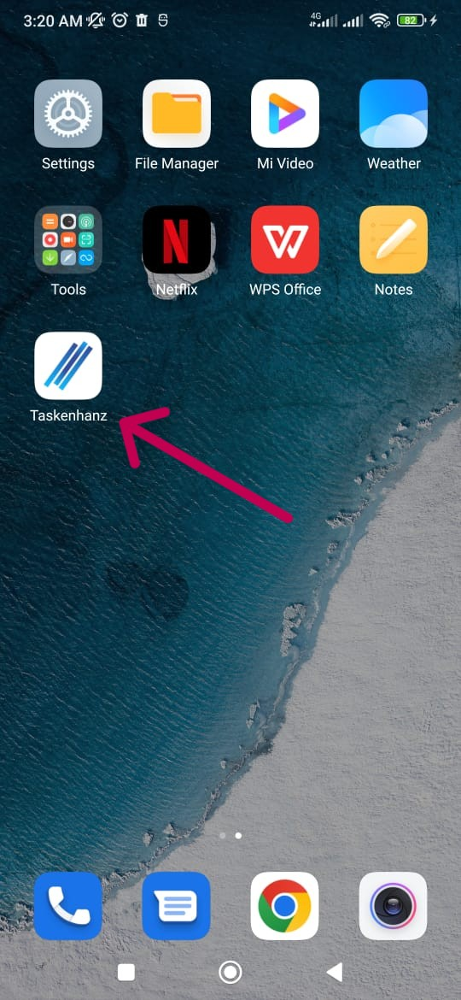
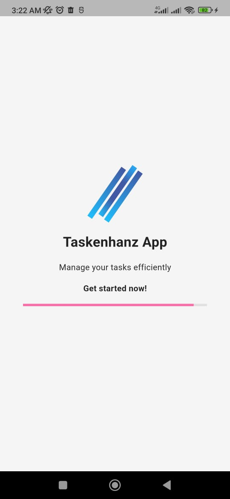
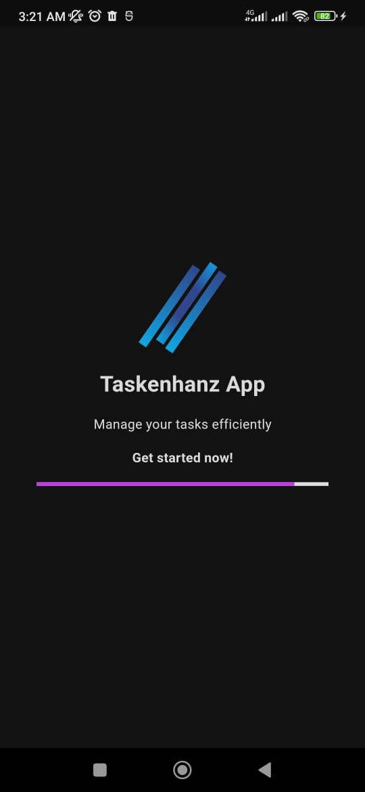
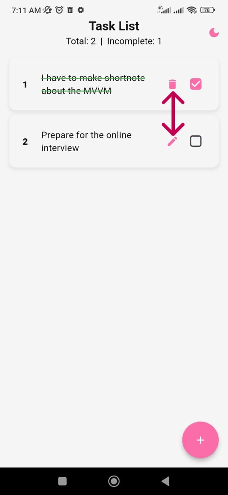
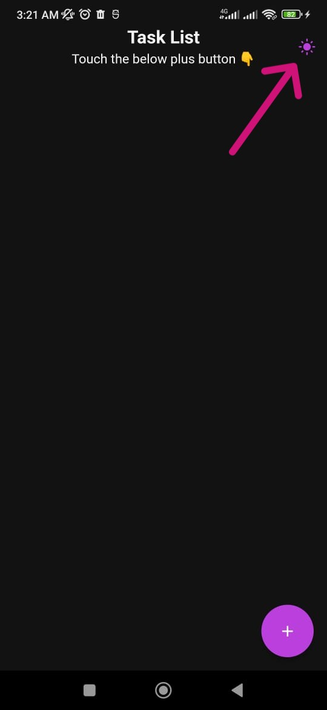
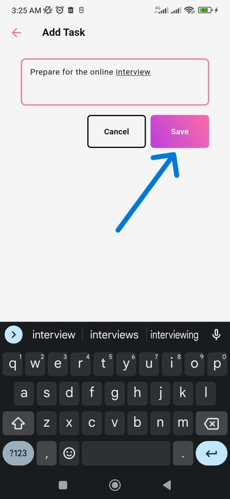
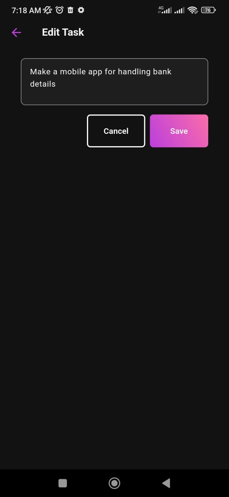
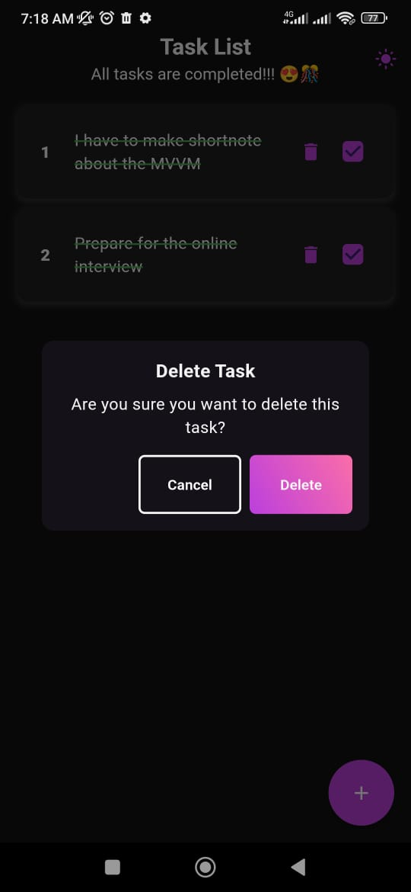
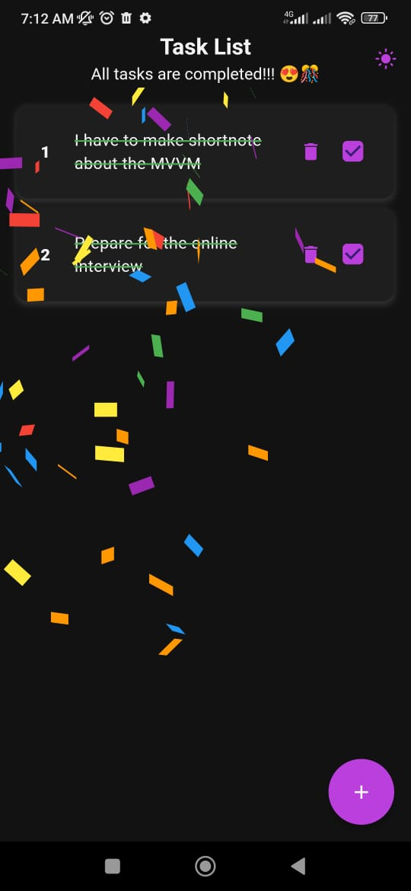

# 📱 Taskenhanz - Task Management App - MVVM

A modern and efficient Flutter-based task management application with MVVM architecture, SQLite local storage and beautiful UI.

## ✨ Features

- 📝 Create, read, update, and delete tasks
- ✅ Mark tasks as complete/incomplete
- 🎨 Beautiful and responsive UI
- 🌓 Dark/Light theme support with persistent settings
- 🎊 Celebration animation when tasks are completed
- 💾 Local data persistence using SQLite
- 📱 Cross-platform support (iOS & Android)
- 🎯 Adaptive design for different screen sizes

## 🛠️ Tech Stack

- **Framework**: Flutter (SDK ^3.5.4)
- **Language**: Dart
- **Database**: SQLite (sqflite ^2.4.1)
- **State Management**: Provider ^6.1.2
- **Local Storage**: Shared Preferences ^2.3.3
- **Architecture**: MVVM (Model-View-ViewModel)
- **Animations**: Confetti (confetti: ^0.8.0)

## 📦 Dependencies

```yaml
dependencies:
  flutter:
    sdk: flutter
  confetti: ^0.8.0
  cupertino_icons: ^1.0.8
  path: ^1.9.0
  provider: ^6.1.2
  shared_preferences: ^2.3.3
  sqflite: ^2.4.1
```

## 📂 Project Structure

lib/
├── models/           # Data models
├── providers/        # State management
├── repositories/     # Data repositories
├── services/         # Business logic services
├── theme/            # App theming
├── views/            # UI screens
├── view_models/      # Manages business logic
├── widgets/          # Reusable widgets
└── [main.dart](http://_vscodecontentref_/1)        # App entry point


## 🚀 Getting Started

 - Prerequisites
 - Flutter SDK (^3.5.4)
 - Dart SDK (^3.5.4)
 - Android Studio / VS Code
 - iOS Simulator / Android Emulator


## 🛠️ Installation

Follow these steps to set up the project on your local machine:

1. **Clone the repository:**
    ```bash
    git clone https://github.com/Yasitha-Bhanuka/todoenhanzer.git
    ```
2. **Navigate to the project directory:**
    ```bash
    cd todoenhanzer
    ```
3. **Install dependencies:**
    ```bash
    flutter pub get
    ```
4. **Run the app:**
    ```bash
    flutter run
    ```

Make sure you have Flutter and Dart SDK installed on your machine. For more information, refer to the [Flutter installation guide](https://flutter.dev/docs/get-started/install).

## 📸 Screenshots

Here are some screenshots of the app in action:












## 🌟 Core Features

- Task creation, editing, and deletion
- Task completion tracking
- Persistent dark/light theme settings
- Local data storage with SQLite
- Cross-platform compatibility (iOS & Android)
- Adaptive UI for various screen sizes

## 🤝 Contributing

Contributions are welcome! Please follow these steps to contribute:

1. Fork the repository
2. Create a new branch (`git checkout -b feature-branch`)
3. Make your changes
4. Commit your changes (`git commit -m 'Add new feature'`)
5. Push to the branch (`git push origin feature-branch`)
6. Create a pull request

## 📄 License

This project is licensed under the MIT License. See the [LICENSE](LICENSE) file for details.

## 👤 Author

- **Yasitha Bhanuka** - [GitHub](https://github.com/Yasitha-Bhanuka)

## 🙏 Acknowledgements

- Flutter community for their amazing support and resources
- All contributors and users for their valuable feedback

## 📞 Contact

For any inquiries or feedback, please contact me at:

- GitHub: [Yasitha-Bhanuka](https://github.com/Yasitha-Bhanuka)